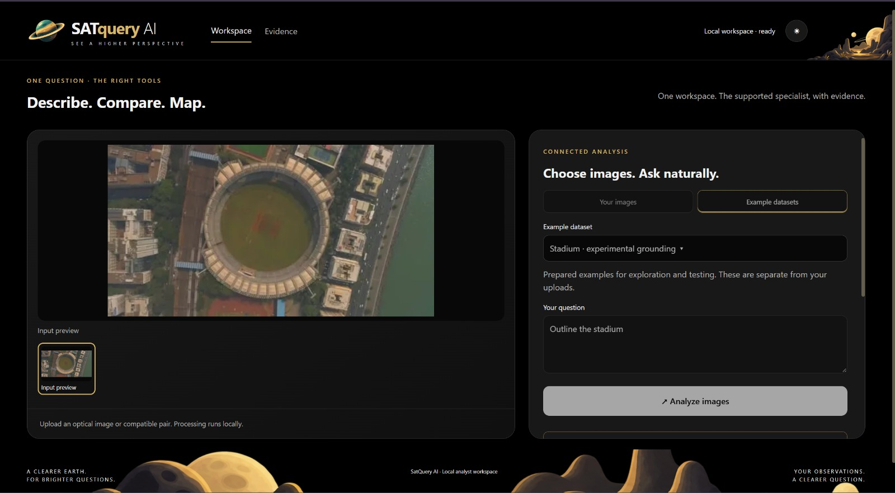
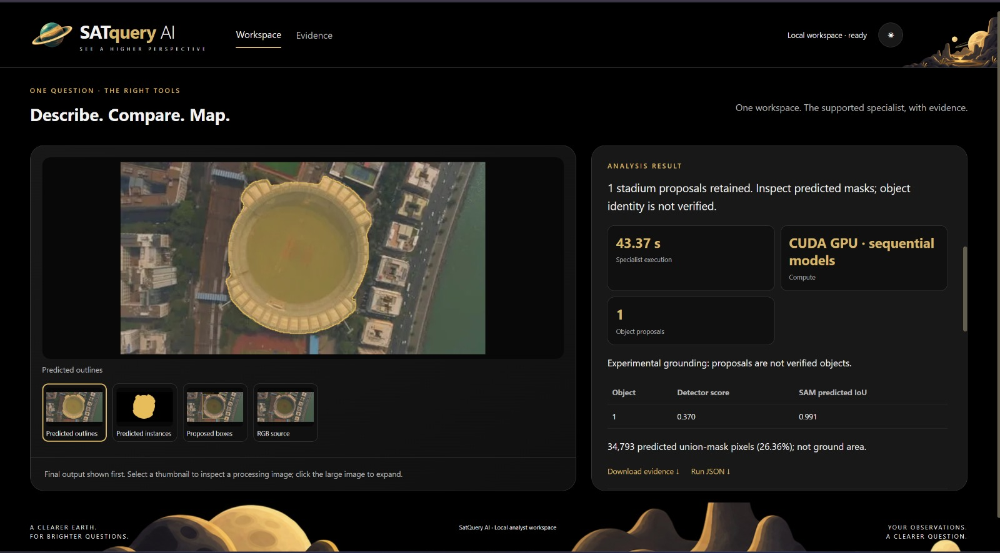

# Grounding

## Overview

SatQuery AI supports spatial grounding, allowing users to connect natural
language queries with specific objects or regions within satellite and aerial
imagery.

Instead of returning only a textual description, Grounding produces a
spatially localized representation of the requested feature, allowing the
user to visually inspect where the model believes the queried object is
located.

## How It Works

The Grounding workflow combines natural-language understanding with visual
object localization and segmentation.

A user provides an image and a natural-language query describing the target
feature. SatQuery processes the request and generates candidate object
proposals, predicted outlines, and segmentation results for the identified
region.

The workflow can be summarized as:

1. Provide an image.
2. Enter a natural-language query describing the target object.
3. SatQuery generates candidate object proposals.
4. The proposed region is segmented and spatially localized.
5. The resulting mask and outline are displayed over the original imagery.
6. Supporting metrics are provided for inspecting the result.

## Demonstration

The following demonstration uses an aerial image of a stadium and asks
SatQuery to identify and outline the stadium.

### Input

The input image contains a large circular stadium surrounded by buildings,
roads, and other urban features.

### Example Query

> Outline the stadium

The query asks SatQuery to identify the stadium and produce a spatial outline
corresponding to the requested object.

### Grounded Result

SatQuery produces a predicted outline covering the stadium and provides
additional visualizations including the predicted instance, proposed boxes,
and the original RGB source.

## Example Output

The Grounding analysis retained **1 stadium proposal** and generated a
predicted spatial mask corresponding to the stadium in the input image.

The result reports:

- **Object proposals:** 1
- **Detector score:** 0.370
- **SAM predicted IoU:** 0.991
- **Predicted union-mask pixels:** 34,793
- **Predicted union-mask coverage:** 26.36%
- **Specialist execution time:** 43.37 seconds
- **Compute:** CUDA GPU using sequential models

The predicted outline closely follows the visible boundary of the stadium,
allowing the identified region to be inspected directly against the original
imagery.

## Understanding the Result

The result provides several complementary views of the grounding process:

- **Predicted outlines** show the final spatial boundary identified by the
  system.
- **Predicted instances** show the segmented object mask.
- **Proposed boxes** provide the candidate object localization generated
  during the detection stage.
- **RGB source** provides the original image for comparison.

The reported **SAM predicted IoU of 0.991** indicates a high overlap score
for the generated segmentation relative to the corresponding prediction
criterion used by the system.

The detector score and segmentation metrics should be interpreted as model
outputs rather than independent verification of the object's identity or
geographic location.

## Experimental Grounding

The demonstrated workflow is explicitly marked as **experimental grounding**.
SatQuery notes that the generated proposals are not independently verified
objects.

In this example, the system retained one stadium proposal and generated a
spatial mask for it, but the output should still be reviewed against the
original imagery when precise object identification is required.

The system also reports that the **34,793 predicted union-mask pixels
represent 26.36% of the analyzed image area** and should not be interpreted
as ground-area measurements.

## What This Demonstrates

This example demonstrates SatQuery's ability to:

- Interpret natural-language spatial queries.
- Identify a requested object within imagery.
- Generate spatial object proposals.
- Produce segmentation masks and predicted outlines.
- Visually connect a language query to a specific region of an image.
- Provide quantitative information about the generated spatial result.

## Potential Applications

Grounding can support workflows such as:

- Geospatial image interpretation
- Infrastructure identification
- Object and region localization
- Remote-sensing research
- Urban-area analysis
- Environmental monitoring
- Geospatial intelligence
- Natural-language driven satellite image exploration

## Technical Notes

Grounding combines object proposal generation with segmentation to produce
a spatially localized result.

The demonstrated workflow uses GPU-based sequential models and reports the
detector score and SAM predicted IoU alongside the resulting mask.

Grounding results should be interpreted in conjunction with the original
imagery, particularly when precise object identity, boundaries, or geographic
measurements are required.
