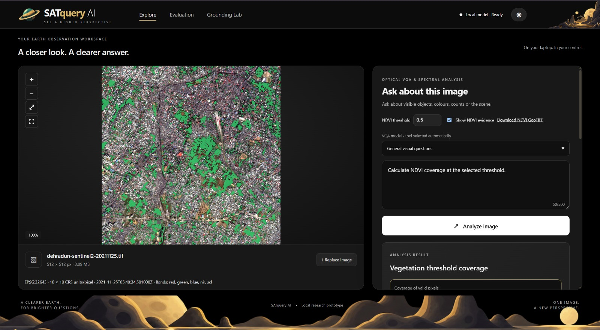
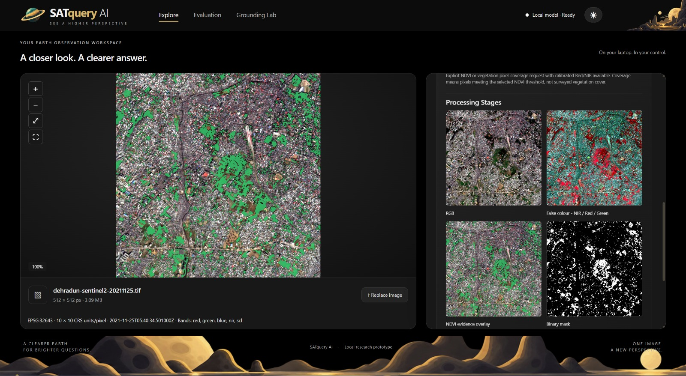
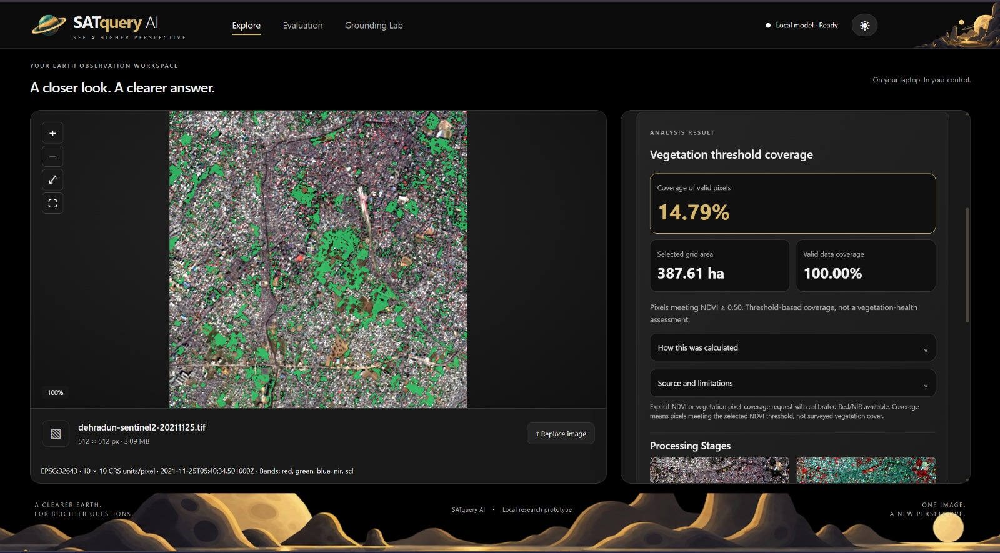

# NDVI / Spectral Analysis

## Overview

SatQuery AI supports NDVI-based spectral analysis for estimating vegetation
coverage from multispectral satellite imagery.

The workflow uses calibrated Red and Near-Infrared (NIR) bands to calculate
NDVI and identify pixels that meet a user-defined vegetation threshold.

Rather than treating vegetation as a simple visual classification, SatQuery
provides a measurable threshold-based analysis together with visual evidence
that allows the result to be inspected against the original imagery.

## What is NDVI?

The Normalized Difference Vegetation Index (NDVI) is a commonly used
spectral index for analyzing vegetation using Red and Near-Infrared
reflectance.

It is calculated as:

$$
NDVI = \frac{NIR - Red}{NIR + Red}
$$

Higher NDVI values generally correspond to stronger vegetation signals,
while lower values can correspond to non-vegetated surfaces.

In SatQuery, users can specify an NDVI threshold and calculate the proportion
of valid pixels that meet or exceed that threshold.

## How It Works

The NDVI workflow uses multispectral imagery containing the required Red and
NIR bands.

The demonstrated workflow can be summarized as:

1. Provide a multispectral satellite image.
2. Verify that calibrated Red and NIR bands are available.
3. Select an NDVI threshold.
4. Calculate NDVI across the valid pixels.
5. Identify pixels meeting the selected threshold.
6. Generate visual evidence and a binary mask.
7. Calculate threshold coverage over the valid image area.
8. Present the resulting measurements alongside the source imagery.

## Demonstration

The following demonstration uses the image:

`dehradun-sentinel2-20211125.tif`

The source image is a **512 × 512 pixel** multispectral image containing
Red, Green, Blue, NIR, and additional spectral information.

The image metadata shown in SatQuery includes:

- **CRS:** EPSG:32643
- **Ground sampling:** 10 × 10 m
- **Acquisition:** 2021-11-25T05:40:34.501000Z
- **Bands:** Red, Green, Blue, NIR, and additional spectral data

### Input and Query

The image is loaded into SatQuery's visual analysis workspace. The NDVI
threshold is set to **0.50**, and the system provides an option to display
NDVI evidence.

### Example Query

> Calculate NDVI coverage at the selected threshold.

The request asks SatQuery to calculate the percentage of valid image pixels
whose NDVI value meets or exceeds the selected threshold.

## Processing

SatQuery presents multiple processing stages to make the spectral analysis
inspectable.

The demonstration provides:

- **RGB** representation of the source image
- **False-colour NIR / Red / Green** visualization
- **NDVI evidence overlay**
- **Binary mask** showing pixels that meet the selected threshold

These intermediate representations provide visual evidence for how the final
threshold-coverage result is derived.

## Analysis Result

For the demonstrated image and threshold, SatQuery reports:

| Metric | Result |
|---|---:|
| NDVI threshold | **0.50** |
| Threshold coverage | **14.79%** |
| Selected grid area | **387.61 ha** |
| Valid data coverage | **100.00%** |

The **14.79%** value represents the proportion of valid pixels meeting the
selected NDVI threshold of **0.50**.

The selected grid covers **387.61 hectares**, while the reported valid-data
coverage is **100.00%** for the analyzed grid.

## Example Output

SatQuery calculates that **14.79% of the valid pixels meet or exceed an
NDVI value of 0.50** for the demonstrated image.

The result corresponds to a selected grid area of **387.61 hectares**, with
**100.00% valid data coverage**.

The system also provides a visual NDVI evidence overlay and a binary mask,
allowing the thresholded pixels to be inspected directly against the original
imagery.

This provides both a quantitative measurement and visual evidence for the
reported vegetation threshold coverage.

## Processing Evidence

The NDVI workflow exposes intermediate processing outputs rather than
returning only a final percentage.

### RGB

The original RGB representation provides the visual context of the observed
area.

### False-Colour NIR / Red / Green

The false-colour composite uses NIR, Red, and Green information to provide a
different representation of vegetation and other land-cover characteristics.

### NDVI Evidence Overlay

The NDVI evidence overlay visualizes the areas identified by the spectral
analysis over the original imagery.

### Binary Mask

The binary mask isolates the pixels that satisfy the selected NDVI
threshold.

Together, these outputs make the calculation easier to inspect and
understand.

## Important Interpretation Note

The reported **14.79% is threshold-based pixel coverage**, not a direct
measurement of vegetation health or a field-survey estimate of vegetation
cover.

SatQuery explicitly distinguishes threshold coverage from a vegetation-health
assessment.

The result therefore means that 14.79% of the valid pixels satisfy the
selected NDVI threshold of 0.50. It should not be interpreted by itself as
meaning that exactly 14.79% of the physical landscape is healthy vegetation.

## Potential Applications

NDVI and spectral analysis can support workflows such as:

- Vegetation monitoring
- Agricultural analysis
- Crop and land-cover assessment
- Environmental monitoring
- Forest monitoring
- Urban green-space analysis
- Remote-sensing research
- Vegetation change analysis

## Technical Notes

NDVI analysis requires imagery containing suitable calibrated Red and
Near-Infrared bands.

The demonstrated dataset contains the required spectral bands and provides
full valid-data coverage for the selected grid.

Results depend on the quality and calibration of the input imagery, band
availability, preprocessing, spatial resolution, and the selected NDVI
threshold.

SatQuery's reported coverage is a threshold-based measurement over valid
pixels and should be interpreted within the context of the imagery and
analysis parameters.
