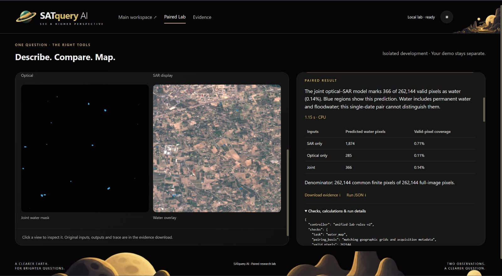

# SAR + Optical Fusion

## Overview

SatQuery AI supports joint analysis of Synthetic Aperture Radar (SAR) and
optical satellite imagery, combining complementary information from both
sensing modalities within a single analysis workflow.

Optical imagery provides rich visual and spectral information, while SAR
imagery provides complementary information that can be useful for identifying
features such as water and other surface characteristics.

By analyzing both modalities together, SatQuery can produce a joint
interpretation rather than treating the optical and SAR observations as
completely independent inputs.

## How It Works

The SAR + Optical Fusion workflow takes paired observations covering the
same geographic region and evaluates them using three analysis paths:

- SAR-only analysis
- Optical-only analysis
- Joint SAR + Optical analysis

The results from these paths can then be compared to understand how the
different modalities contribute to the final interpretation.

The workflow can be summarized as:

1. Provide geographically paired SAR and optical imagery.
2. Validate that the inputs are compatible for joint analysis.
3. Process the SAR and optical observations independently.
4. Combine the complementary information from both modalities.
5. Generate a joint output and quantitative measurements.
6. Present the result alongside the individual modality outputs.

## Demonstration

The following demonstration shows SatQuery performing a paired SAR + Optical
analysis for water detection.

### Input Modalities

The demonstration contains two views of the same geographic region:

- **Optical:** An optical satellite image showing the visual characteristics
  of the landscape.
- **SAR:** A Synthetic Aperture Radar observation providing complementary
  radar-based information about the same region.

The system produces a **Joint Water Mask** from the paired observations and
also provides a water overlay for visual inspection.

## Paired Analysis Result

The joint analysis identifies **366 predicted water pixels out of 262,144
valid pixels**, corresponding to **0.14% valid-pixel coverage**.

The results from the individual and joint analysis paths are:

| Input | Predicted Water Pixels | Valid-Pixel Coverage |
|---|---:|---:|
| SAR only | 1,874 | 0.71% |
| Optical only | 285 | 0.11% |
| Joint | 366 | 0.14% |

This allows the output of the joint model to be examined alongside the
individual SAR and optical predictions.

## Example Output

The joint SAR + Optical model identifies **366 pixels as water** from the
262,144 valid pixels in the paired scene.

SatQuery visualizes these predictions as a **joint water mask** and provides
a corresponding water overlay on the optical imagery. The result also
includes the individual SAR-only and optical-only predictions, making it
possible to compare how the different inputs contribute to the analysis.

The system reports an execution time of approximately **1.15 seconds** on
**CPU** for the demonstrated analysis.

The result also explicitly notes an important limitation: because the
demonstration uses a **single-date image pair**, the analysis cannot
distinguish between permanent water and floodwater based on this observation
alone.

## Why Combine SAR and Optical?

SAR and optical sensors observe the Earth's surface using different physical
properties.

Optical imagery can provide detailed visual and spectral information, while
SAR can provide complementary information that is less dependent on visible
illumination conditions.

Combining the two modalities can therefore provide a broader information
base for remote-sensing analysis than relying on either modality alone.

## Potential Applications

SAR + Optical Fusion can support workflows such as:

- Water detection
- Flood assessment
- Surface-condition analysis
- Environmental monitoring
- Agricultural monitoring
- Land-use and land-cover analysis
- Multimodal remote-sensing research
- Geospatial intelligence

## Technical Notes

Successful paired analysis requires the SAR and optical observations to be
compatible and geographically aligned.

The demonstrated workflow uses a common valid-pixel denominator of
**262,144 pixels** for the reported comparison.

The water predictions shown in this demonstration represent model output and
should be interpreted in the context of the input imagery, acquisition
conditions, preprocessing, and the limitations of single-date analysis.
