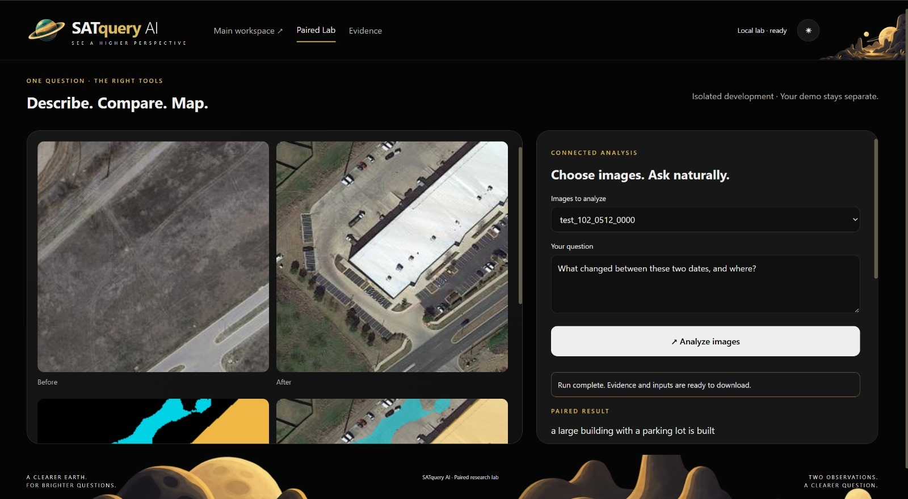
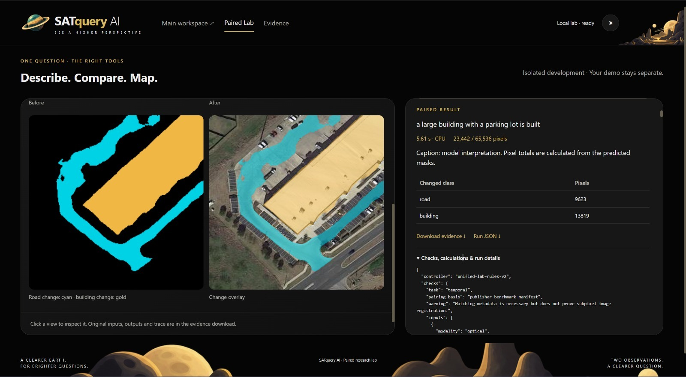
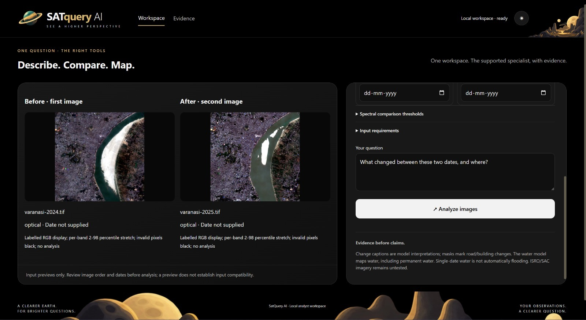
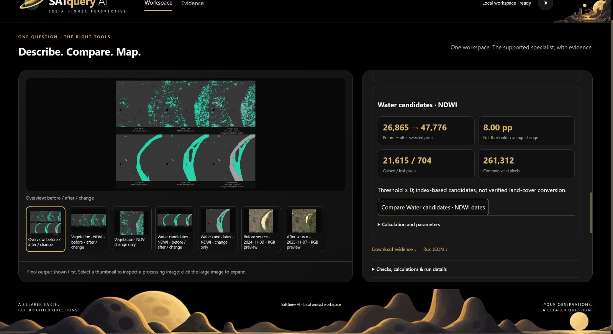

# Temporal Analysis

## Overview

SatQuery AI enables analysis of satellite imagery across multiple points in
time, allowing users to identify, interpret, and describe changes within a
geographic region.

Rather than analyzing an individual image in isolation, Temporal Analysis
provides a way to reason about how a scene has evolved between different
observations.

## How It Works

SatQuery compares satellite imagery acquired at different points in time and
uses multimodal analysis to identify meaningful changes within the observed
area.

The analysis can help identify changes in:

- Infrastructure
- Land use and land cover
- Vegetation
- Roads and transportation networks
- Construction and development
- Water bodies and river boundaries
- Sediment and sand accumulation
- Other visible geographic features

## Demonstration

The following demonstration shows SatQuery analyzing satellite imagery of the
Varanasi riverbank across different observation dates to identify changes in
the riverbank and surrounding area.

### Before

The first satellite observation represents the earlier state of the
Varanasi riverbank.

### After

The second satellite observation represents the later state of the same
region.

### Temporal Comparison

SatQuery generates a visual comparison of the two observations, highlighting
areas that have changed between the observation dates.

In this demonstration, the comparison shows noticeable changes along the
Varanasi riverbank, including the accumulation and expansion of exposed sand
between the two observations.

The comparison also provides separate visualizations for vegetation-related
and water-related changes, allowing individual aspects of the scene to be
examined.

### Analysis Output

SatQuery provides quantitative information alongside the visual change
maps, allowing the detected changes to be examined using measurable
indicators.

For this demonstration, the imagery spans the observation period from
**30 November 2024 to 7 November 2025**. The analysis identifies changes
along the riverbank, including changes associated with exposed sand,
vegetation, and water-related regions.

The vegetation analysis uses NDVI-based thresholding to quantify changes in
selected vegetation pixels, while the water-candidate analysis identifies
changes in regions associated with water.

The results provide both visual and quantitative evidence for understanding
how the riverbank changed between the two observations.

## Example Query

> Compare the two satellite images of the Varanasi riverbank and identify the
> major changes that occurred between the two observation dates. Pay
> particular attention to changes in the river boundary, sand or sediment
> accumulation, vegetation, and other significant changes visible in the
> surrounding area.

## Example Output

SatQuery identified noticeable changes along the Varanasi riverbank between
the two satellite observations. The most prominent visible change was the
accumulation and expansion of exposed sand along portions of the riverbank,
resulting in a change in the shape and extent of the exposed riverbank area.

The analysis also identified changes in vegetation and water-related regions.
NDVI-based analysis quantified vegetation-related changes, while the
water-candidate analysis highlighted regions where the detected water extent
changed between the observations.

For the demonstrated period, SatQuery reported changes in vegetation-related
pixels from **11,128 to 49,093 selected pixels**, with a **14.53 percentage
point net threshold coverage change**. The analysis also identified
**39,746 gained pixels** and **1,781 lost pixels**, with **261,312 common
valid pixels** across the two observations.

The temporal analysis therefore combines visual change maps with quantitative
measurements, allowing users to examine how a geographic region has evolved
over time rather than treating each satellite image independently.

## Potential Applications

Temporal analysis can support workflows such as:

- Environmental monitoring
- Riverbank and sediment monitoring
- Infrastructure monitoring
- Urban development analysis
- Agricultural monitoring
- Disaster assessment
- Geospatial research
- Land-use and land-cover change detection

## Technical Notes

Temporal Analysis is one component of SatQuery's multimodal remote-sensing
workflow. Its effectiveness depends on the quality, spatial alignment,
acquisition dates, and characteristics of the satellite imagery being
compared.

The demonstrated workflow combines visual change detection with spectral
analysis to provide both qualitative and quantitative information about the
observed region.
