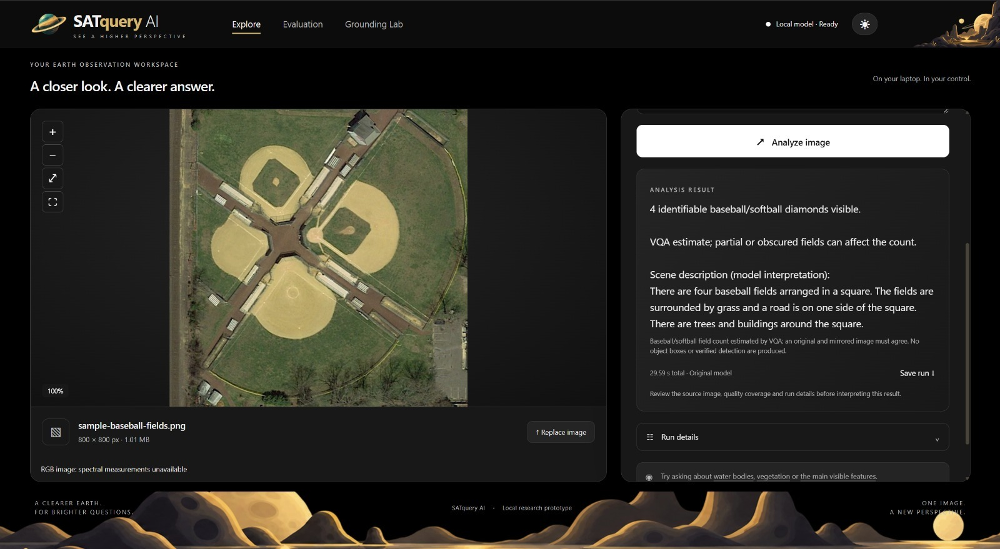

# Visual Question Answering

## Overview

SatQuery AI enables users to interact with satellite imagery using natural
language and receive responses based on the visual information present in
the provided image.

Visual Question Answering (VQA) allows users to ask questions about objects,
structures, and other visible features in satellite imagery without having
to manually interpret the entire scene.

## How It Works

A satellite or aerial image is provided as the visual input. SatQuery
analyzes the image and generates a natural-language response based on the
question and the visual information available in the scene.

The workflow can be summarized as:

1. Provide an image.
2. Ask a natural-language question about the image.
3. SatQuery analyzes the visual content relevant to the question.
4. The system generates an interpretable response.

## Demonstration

The following example uses an aerial image containing multiple
baseball/softball fields.

### Input Image

The input image shows a sports complex containing multiple baseball/softball
diamonds arranged around a central area. The fields are surrounded by
grass, with roads, trees, buildings, and other structures visible around
the complex.

The image used in the demonstration is an RGB image with a resolution of
**800 × 800 pixels**.

## Example Query

> How many baseball or softball fields are visible in the image?

## Example Output

SatQuery's VQA analysis identified **4 identifiable baseball/softball
diamonds** in the image.

The model also generated a scene description:

> There are four baseball fields arranged in a square. The fields are
> surrounded by grass and a road is on one side of the square. There are
> trees and buildings around the square.

The result also notes that the count is a **VQA estimate**, meaning that
partially visible or obscured fields can affect the result. The system
therefore presents the answer as an interpretation of the image rather than
claiming object-level verification.

The demonstrated run was completed using the **Original Model**, with a
reported total execution time of approximately **29.59 seconds**.

## What This Demonstrates

This example demonstrates SatQuery's ability to:

- Identify and count visually recognizable objects in satellite or aerial
  imagery.
- Answer questions using natural language.
- Provide a descriptive interpretation of the surrounding scene.
- Combine a specific visual question with broader scene understanding.
- Communicate uncertainty when the image does not provide complete or
  unobstructed visual evidence.

## Applications

VQA can support workflows such as:

- Satellite image interpretation
- Remote-sensing research
- Land-use and land-cover analysis
- Infrastructure inspection
- Environmental monitoring
- Geospatial intelligence
- Natural-language exploration of satellite imagery

## Technical Notes

VQA is designed as an interaction layer between users and SatQuery's
multimodal vision-language capabilities.

The quality and specificity of the response depend on factors such as image
resolution, image quality, visible features, and the degree to which the
requested objects or regions are observable in the input imagery.

Results should therefore be interpreted as model-generated visual analysis
and reviewed against the source imagery when accuracy is important.
